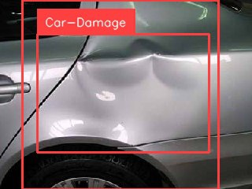

<strong>Задача проекта:</strong>&nbsp;написать telegram-бот, который определит область повреждения автомобиля .

<strong>Описание проекта:</strong>&nbsp;при помощи интегрирования модели машинного обучения &laquo;car-damage-coco-dataset/4&raquo; бот принимает от пользователя изображение и определяет место повреждения автомобиля, направляя в чат изображение с выделенной областью:

<strong>Инструменты:</strong>&nbsp;Python: библиотеки Telebot, Requests, cv2

